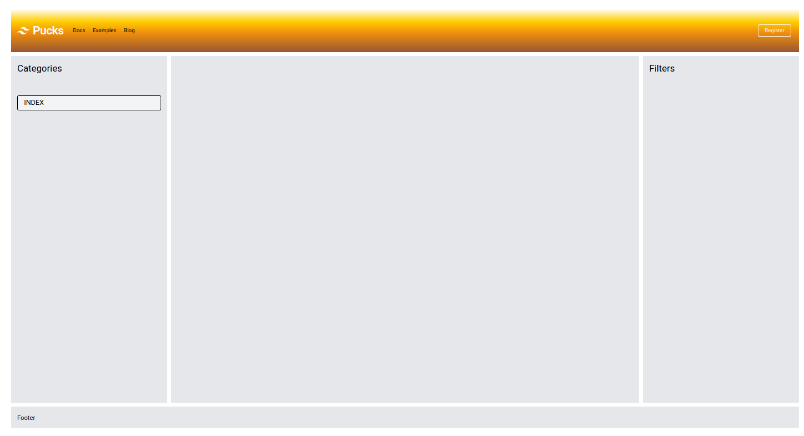
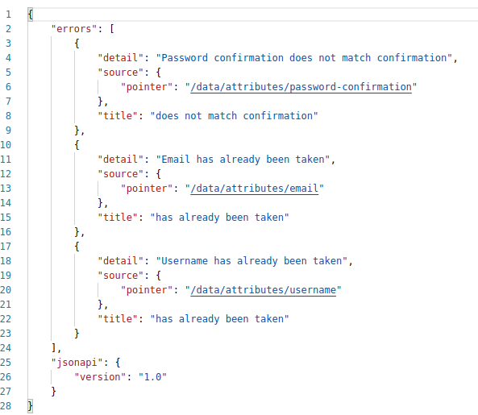
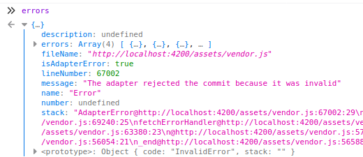
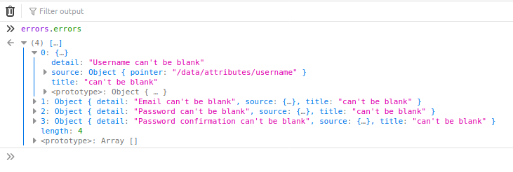
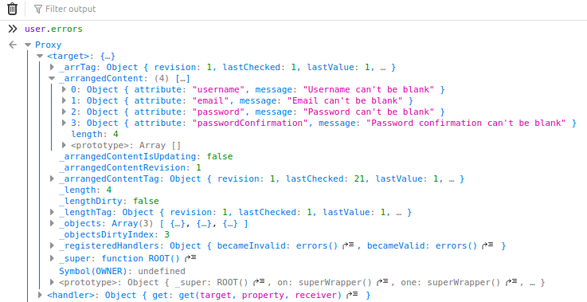
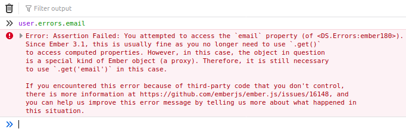
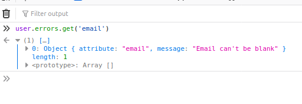
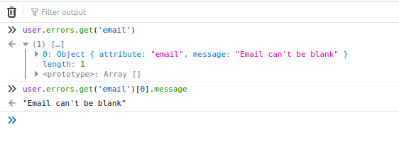
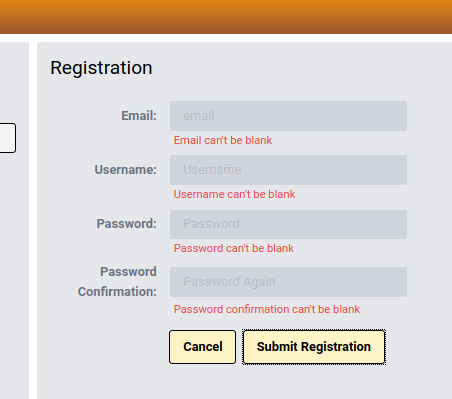

# User Registration, Authentication, and Authorization with Ember Octane and Phoenix

## Part 2: Ember Octane Setup and User Registration

June 14, 2020.
_____
**Fair warning**:  *I am a hack. I am an civil engineer that has a hobby doing web development. Follow me at your own risk!* That said, others may find it worthwhile to read my experiences in developing a web app.

Big Thanks to [**Embercasts**]() excellent course on using [Ember with a Phoenix backend]().  I have watched it three times, and bits and pieces over and over again. I cannot stress enough how well presented and thourough Ryan Tablada and Erik Brin were in putting this course together. The course is a couple of years old; it uses Ember v3.0.X, --which still works in the current version. It is still well worth the purchase price. The last time I went thorough the videos was to update the Ember code to Octane -- which turned out to be an excellent exercise in self-learning to understand Octane syntax, patterns, and implementation.

That said, I have made some changes to packages used, obviously updated to the current versions of both Ember and Phoenix, and implemented a few thing is different ways -- but full credit to previous works.

For this application, I will be using [Elixir Phoenix](https://www.phoenixframework.org/) (v1.5.3) as the backend that will serve up [JSON:API](https://jsonapi.org/) complient json to be used by an frontend developed in [Ember.js](https://emberjs.com/) ---  specifically *[Ember Octane](https://blog.emberjs.com/2019/12/20/octane-is-here.html)* --- this app will use Ember(v3.23).

This write up assumes you have all the necessary precursors installed as I will not be going over any of that. Suffice to say that you have to have elixir, mix, phoenix etc installed, posgresql (and postgis -- *just because* -- ) as well as npm, yarn, ember-cli etc, etc. I will try to point out where I found that additional programs or dependencies needed to be updated or installed, but realize YMMV.

A note about the application. It is called **pucks** --- like hockey pucks.  I am Canadian. I like hockey. If this series of blog posts evolves into an on-going thing, then most folks will be able to understand the basic concepts and structure of players, leagues, teams, seasons, etc.

____________

### Ember Setup

And ...we're off!  Create a new ember application -- We will call it *pucks_ui*.

```ember new pucks_ui --yarn```

We have our new ember octane application.  I will use TailwindCss for easier styling, and the **[ember-auto-import]()** addon which allows you to directly import additional npm packages in ember apps.

```ember install ember-auto-import```

To pull in Tailwind, I follow the [step-by-step write up](https://github.com/chrism/emberjs-tailwind-purgecss) provided by *Chris Masters* (Thanks Chris). Chris provides various levels of adding Tailwind from basic to advanced.  Choose the advanced method near the bottom of the post/readme. If you do the same, we will be where we need to be to continue. 

I want a basic layout for this applation. A navigation bar along the top, some side naviagtion along the left side, a area for filters and searches on the right -- main content in the center and a footer.  

### insert diagram

Thank god for css-grid.  We will use css-grid to devleop the layout.  I realize that Tailwind has added css-grid support, however I find it easier just to write it in normal css for this part of our design.
Here is the ```base-grid.css``` file I developed. 
```css
/* ./app/styles/base-grid.css */
body {
  padding: 20px;
}
.wrapper {
  padding: 20px;
  display: grid;
  grid-template-columns: 1fr 3fr 1fr;
  grid-template-rows: 2fr 16fr 1fr;
  grid-gap: 10px;
}
.sidebar {
  grid-column: 1 / 2;
} 
.content {
  grid-column: 2 / 3;
}
.filters {
  grid-column: 3 / -1;
}
.header {
  grid-column: 1 / -1;
  
  background: linear-gradient(0deg, 
                            rgba(153,87,50,1) 0%, 
                            rgba(242,145,13,1) 46%, 
                            rgba(255,207,0,1) 71%, 
                            rgba(255,255,255,1) 100%);
}
.footer {
  grid-column: 1 /-1;
}
```
Don't forget to **@import** the ```base-grid.css``` file into your ```app.css``` file.

I am going to make components for the top-nav, side-nav, and side-filters parts of the layout. While not entirely necessary now, I will also create the backing javascript classes for each component with the ```-gc``` flag ("gc" == "glimmer component").
```zsh
ember g component -gc top-nav
ember g component -gc side-nav
ember g component -gc side-filters
```
Focussing on our application template, we can add these (currently empty) components to the template:
```hbs
<!-- ./app/templates/application.hbs -->
<div class="wrapper">
  <TopNav  />

  <SideNav />

  <section class="content p-4 bg-gray-200">
      {{outlet}}
  </section>

  <SideFilters />

  <footer class="footer p-4 bg-gray-200">Footer</footer>
</div>
```
Okay, let's give the components life. <TopNav /> first.  I cut-pasted-edited this nav bar right from the tailwind docs... even keeping the tailwind svg logo as a reminder to replace it later.
```hbs
<!-- ./app/components/top-nav.hbs -->
<nav class="header flex items-center justify-between flex-wrap px-4 py-6">
  <LinkTo @route="index" class="no_underline">
    <div class="flex items-center flex-shrink-0 text-white mr-6">
      <svg class="fill-current h-8 w-8 mr-2" width="54" height="54" viewBox="0 0 54 54" xmlns="http://www.w3.org/2000/svg"><path d="M13.5 22.1c1.8-7.2 6.3-10.8 13.5-10.8 10.8 0 12.15 8.1 17.55 9.45 3.6.9 6.75-.45 9.45-4.05-1.8 7.2-6.3 10.8-13.5 10.8-10.8 0-12.15-8.1-17.55-9.45-3.6-.9-6.75.45-9.45 4.05zM0 38.3c1.8-7.2 6.3-10.8 13.5-10.8 10.8 0 12.15 8.1 17.55 9.45 3.6.9 6.75-.45 9.45-4.05-1.8 7.2-6.3 10.8-13.5 10.8-10.8 0-12.15-8.1-17.55-9.45-3.6-.9-6.75.45-9.45 4.05z"/></svg>
      <span class="font-semibold text-3xl tracking-tight">Pucks</span>
    </div>
  </LinkTo>  

  <div class="block lg:hidden">
    <button type="button" class="flex items-center px-3 py-2 border rounded text-teal-200 border-teal-400 hover:text-white hover:border-white">
      <svg class="fill-current h-3 w-3" viewBox="0 0 20 20" xmlns="http://www.w3.org/2000/svg"><title>Menu</title><path d="M0 3h20v2H0V3zm0 6h20v2H0V9zm0 6h20v2H0v-2z"/></svg>
    </button>
  </div>

  <div class="w-full block flex-grow lg:flex lg:items-center lg:w-auto">
    <div class="text-sm lg:flex-grow">
      <button type="button"   class="block mt-4 lg:inline-block lg:mt-0 text-teal-200 hover:text-white mr-4">
        Docs
      </button>
    </div>

      <div>
        <LinkTo @route = "index" class="mx-1 logging-btn" >Register</LinkTo>
      </div>
  </div>
</nav>
```
Where I have a **LinkTo** component, I am passing in the ```"index"``` route to avoid errors when rendering due to not creating routes yet.  As we create the routes, we will update the **@route** parameter.

I have also extracted some classes to avoid polluting the html/hbs with long lines of tailwind.  Once I have a style for buttons or inputs etc I am happy with, I extract it to a css class with the **@apply** function provided by Tailwind.  There are currently placed in the ```components.css``` file.
```css
/* ./app/styles/components.css */
.list-item {
  @apply border rounded border-2 border-black bg-gray-100 px-4 py-1 my-3;
}
.list-item:hover {
  @apply bg-yellow-500 text-white;
}
.add-btn {
  @apply bg-yellow-100 text-black font-semibold  py-2 px-4 border border-black  rounded;
}
.add-btn:hover {
  @apply bg-yellow-500 text-white border-transparent;
}
.std-input {
  @apply bg-gray-300 appearance-none border-2 border-gray-200 rounded w-full py-2 px-4 text-gray-700 leading-tight;
}
.std-input:focus {
  @apply outline-none bg-yellow-100 border-black;
}
.logging-btn {
 @apply inline-block text-sm px-4 py-2 leading-none border rounded text-white border-white; 
}
.logging-btn:hover {
  @apply border-transparent text-teal-500 bg-white;
}
```
Now the **SideNav** component:
```hbs
<!-- ./app/components/side-nav.hbs -->
<aside class="sidebar p-4 bg-gray-200">
  <p class="text-2xl mb-4">Categories</p>
  <hr>
  <div class="flex flex-col  ">
    <div class="m-3"></div>
 
    <div class="list-item">
      <LinkTo @route="index" class="text-lg mt-4 no_underline uppercase">Menu 1</LinkTo>
    </div>
   <div class="list-item">
      <LinkTo @route="index" class="text-lg mt-4 no_underline uppercase">Menu 2</LinkTo>
    </div>
  </div>
</aside>
```
And **SideFilters** to round it out.
```hbs
<!-- ./app/components/side-filters.hbs -->
<aside class="filters bg-gray-200 p-4">
  <p class="text-2xl">Filters</p>
  <hr>
</aside>
```
Let's fire up our ember server and see what it looks like. (Note: *ember serve* also works.)
```zsh
> yarn start
```
This is what it should look like:



Okay. That's a bit of leg work, but we now have a solid layout upon which to build. For me, as an inexperience (and --- need I stress again --- part-time hack) developer, getting a basic look and styling for the app was a battle. If I felt I was loosing this battle, I would retreat to a point where I was not able to focus on the development I really wanted to learn about. Hopefully this basic layout (tweaked to your hearts content) will provide a basis for others to move on.

Let's commit the setup and layout.
```zsh
git add .
git commit -am 'inital commit with tailwind, ember-auto-import, and basic layout established'
```
______
Now for **Registration**. Here is a diagram of how the registartion will work:

**insert diagram**

We will start with generating the registration route (which also creates a template). May as well generate a controller while we are at it since we are going to need it.

```zsh
ember g route registration
ember g controller registration
```
I also want a component for our registartion form:

```zsh
ember g component -gc registration
```
An we cannot forget about the **User** model.
```zsh
ember g model user email:string username:string password:string password_confirmation:string
```
With that, we should be good to go. 
Generating our registration route also added the route to our ```./app/router.js``` file. When we navigate to the ```/registration``` url, the registration.hbs will be displayed -- basic ember stuff, so I will not go into it in detail.

Other than entering the url directly into the address bar of the browser, however -- there is no way to currently navigate to this route. Let's fix that by passing ```@route="registration"``` to the registration button (actually a link) in our **TopNav** component.
```hbs
<!--./app/components/top-nav.hbs --> 
<!-- ....  -->
      <div>
        <LinkTo @route = "registration" class="mx-1 logging-btn" >Register</LinkTo>
      </div>
  </div>
</nav>
```
There. Go to the app and click on the register button in the upper right and the url changes. Nothing displays but we will soon fix that. Clicking on the application title returns us to our home page (not that we have a home page --  but the root of our application). If you want to add a "home page", simply create and ```./app/templates/index.hbs``` file and put whatever you want in it and it will show up when we are at the root url. Go ahead ... I dare you!


Turning our attention to the ```registration-form.hbs``` component -- let's set up a basic entry form to register a user:
```hbs
<!-- ./app/components/registration-form.hbs -->
<div class="text-2xl mb-2">
  Registration
</div>
<hr>

<form class="w-full max-w-md mt-4"  >
  <div class="md:flex md:items-center mb-2">
    <div class="md:w-1/3">
      <label class="block text-gray-500 font-bold md:text-right mb-1 md:mb-0 pr-4" >
        Email:
      </label>
    </div>
    <div class="md:w-2/3">
      <Input class="std-input"  type="text" @value={{this.email}} placeholder="email" />
    </div>
  </div>

  <div class="md:flex md:items-center mb-2">
    <div class="md:w-1/3">
      <label class="block text-gray-500 font-bold md:text-right mb-1 md:mb-0 pr-4" >
        Username:
      </label>
    </div>
    <div class="md:w-2/3">
      <Input class="std-input"  type="text" @value={{this.username}} placeholder="Username" />
    </div>
  </div>

  <div class="md:flex md:items-center mb-2">
    <div class="md:w-1/3">
      <label class="block text-gray-500 font-bold md:text-right mb-1 md:mb-0 pr-4" >
        Password:
      </label>
    </div>
    <div class="md:w-2/3">
      <Input class="std-input"  type="password" @value={{this.password}} placeholder="Password" />
    </div>
  </div>

  <div class="md:flex md:items-center mb-2">
    <div class="md:w-1/3">
      <label class="block text-gray-500 font-bold md:text-right mb-1 md:mb-0 pr-4" >
        Password Confirmation:
      </label>
    </div>
    <div class="md:w-2/3">
      <Input class="std-input"  type="password" @value={{this.passwordConfirmation}} placeholder="Password Again" />
    </div>
  </div>

  <div class="md:flex md:items-center mt-4">
    <div class="md:w-1/3"></div>
    <div class="md:w-2/3">
      <LinkTo class="add-btn" @route="index" >Cancel</LinkTo>
      <button class="add-btn" type="submit" >Submit Registration</button>
    </div>
  </div>
</form>
```
There is a lot going on here, especially if you are not familiar with the *Octane* way of doing things, but we will break it down as we go.

In order to see the form, we have to include it in the ``registration.hbs`` template.
```hbs
<!-- ./app/templates/registration.hbs -->
<RegistrationForm />
```
Click on the Register button and here is what you should see:


**insert screenshot**

So let's start to break it down. Obviously we have a four field form. Two "buttons" at the bottom hand either submission (although not yet) or canceling back to the home route (hanled with a LinkTo, but styled like a button).

Each field is given a value parameter of email, username, password, or passwordConfirmation. These are placed within curly braces (handlebars) and referenced with ```this.``` since they are backed in the components class (```registration-form.js```).

Let's look at the components class file and add some code.
```javascript
import Component from '@glimmer/component';

export default class RegistrationFormComponent extends Component {
}
```
Before we go any further, the time has come to create a ```jsconfig.json``` file in the top level directory to permit experimentalDecorators ... to keep VSCode from squacking since we are about to use decorators. You will have to close and restart VSCode for it to take effect.
```json
// ./jsconfig.json
{
  "compilerOptions": {
      "experimentalDecorators": true
  }
}
```
First, we want to *track* the four properties in the form. We import **tracked** and use it to decorate the properties.

## User Model 

We need a user model. 
```zsh
ember g model user
```
Pretty typical Ember stuff here. Open the UserModel and we can add our attributes. Octane uses decorartors (@attr) for this

```javascript
// ./app/models/user.js
import Model, { attr } from '@ember-data/model';

export default class UserModel extends Model {
  @attr('string') email;
  @attr('string') username;
  @attr('string') password;
  @attr('string') passwordConfirmation;
}
```

Now we turn our attention to the *registration-form* component. First, we want to *track* the four properties in the form. We import **tracked** and use it to decorate the properties.

```javascript
// ./app/components/registration-form.js
import Component from '@glimmer/component';
import { tracked } from '@glimmer/tracking';

export default class RegistrationFormComponent extends Component {

@tracked email;
@tracked username;
@tracked password;
@tracked passwordConfirmation;

}
```
Clicking **Submit** on the form does nothing so we want to wire it up. There are a couple of ways to go here, but I am going to opt for the component to handle the form submission -- and within that function, it will call an @action (that is passed into the component) on the registration controller to handle the actual saving of the *User*. We could handle that all in the component by importing some additional services (like the *store* ) -- which are wired up to the controller by default -- but I have yet to find a resource that explains the benefits or pitfalls of various approaches. 

When the form is submitted, we will fire an action called *submitUser*. In the form itself, we use the ```{{on}}``` modifier. I really like this approach that was introdued as part of the build up to *Octane*. Done like so:
```hbs
<!-- ./app/components/registration-form.hbs -->
<div class="text-2xl mb-2">
  Registration
</div>
<hr>

<form class="w-full max-w-md mt-4" {{on "submit" this.submitUser}} >

<!-- ....... -->
```
Just as it reads, on "Submit", we want to fire the **submitUser** action (the ```this.``` scope refers to the backing class in this case, and is denoted from passed in parameters which are prefaced with ```@```).

We now have to add this function to the actions in our component (and ```import``` ```{ action }``` while we are at it):
```javascript
// ./app/components/registration-form.js
import Component from '@glimmer/component';
import { tracked } from '@glimmer/tracking';
import { action } from '@ember/object';

export default class RegistrationFormComponent extends Component {
// .....
@action
submitUser(ev) {
  ev.preventDefault();

  this.args.registerUser({
    email: this.email,
    username: this.username,
    password: this.password,
    passwordConfirmation: this.passwordConfirmation
  }) 
}
}
```
Let's unpack this. Submiting the form fires the *submitUser* action. In that function, we prevent the default behaviour of the browser when handling a *submit* event(which is to *refresh*). We then call the **registerUser** function and pass it in the **@values** from the form field, assigning them to the *tracked* properties. -- but where does the ```this.args.registerUser``` function come from? We have to pass it to the component when we invoke it in the ```registration.hbs``` template. Like so:
```hbs
<!-- ./app/templates/registration.hbs -->

<RegistrationForm @registerUser={{this.registerUser}} />
```
Remembering anything prefaced with an ```@``` is passed to the component -- the ```@registerUser``` is what we are calling, and because it is passed in, in the component class we must use ```args``` to identify that fact (```this.args.registerUser```). 
The ```{{this.registerUser}}``` part of the invocation refers to the **registerUser** action on the *controller*. They do not have to be called the same thing -- in fact it would be easier to follow if they were not; we could have used ```@paramRegisterUser={{this.ctlrRegisterUser}}``` and adjust the component and controller actions accordingly --- but we didn't and we won't.

Let's wire up the controller action -- for now, we will just ```console.log``` out the attributes.
```javascript
// ./app/controller/registration.js
import Component from '@glimmer/component';
import { action } from '@ember/object';

export default class RegistrationController extends Controller {

@action
registerUser(attrs){
  console.log(attrs); 
}
}
```
Enter some test in the field and submit the form --- examinng the console, you see the pojo of properties that you entered in each field.  That means our component is wired up properly. But were are not doing anything with the submited values. Lets change that.

First things first --- we need to tell the ember application where the back-end server is located. We do this by setting up an **adapter** --- and then specifying the **host** property. We can use a generator to create the application adapter.
```zsh
ember g adapter application
```
Then within the adapter file, we specify the **host**.
```javascript
// ./app/adapters/application.js
import JSONAPIAdapter from '@ember-data/adapter/json-api';

export default class ApplicationAdapter extends JSONAPIAdapter {

  host = 'http://localhost:4000'
}
```
Okay, with that out of the way -- let's wire up the ui with the server-side. 
```javascript
// ./app/controllers/registration.js 
import Controller from '@ember/controller';
import { action } from '@ember/object';

export default class RegistrationController extends Controller {

@action
async registerUser(attrs) {
  // console.log(attrs);
  let user = this.store.createRecord('user', attrs);

  try {
  await user.save();
  this.transitionToRoute('index');
  } catch(err) {
    console.log(err);
  }
}

}
```
We are using ember-data, in case I have not explicitly stated that. We **createRecord** in the local-data *store*, passing in the model ('user') and the attributes from the form. We then attempt to save the record to the server. and if it is successful, we transition back to the root route. If not, for now, we log the errors provided by the server.

For this to work, you need to ensure the phoenix server is serving up the application developed in [Part 1]() of this series.

Now, enter in a valid user and submit. If you look at the phoenix server, you will see a new record created. You can add a ```console.log``` statement after the **save** action if you want some feedback in the browser.

Looking at the console after the user is successfully submited, you will notice a deprication warning. 

**insert screenshot**

The sister-class of an **adapter** in ember is a **serializer**. Like the warning states, ember wants you to explicitly declare which serializer we are using (which happens to be the current default **JSONAPISerializer**). But, explicit is better than implicit, so we squash the deprication warning by creating a serializer:
```zsh
ember g serializer application
```
This creates a new serializer that happens to extend from the ```JSONAPISerializer```. In the future, this default behaviour may change.  Here is the newly created file:
```javascript
// ./app/serializers/application.js
import JSONAPISerializer from '@ember-data/serializer/json-api';

export default class ApplicationSerializer extends JSONAPISerializer {
  }
```
Submit a new valid user, and the deprication warning will be gone.

### Handling the Errors

Our happy path is working, but what happens when errors happen? Our backend will provide us with JSON-API formatted error messages, we have to handle them the *try-catch* block. I must admit --- figuring this out in *Octane* has been challenging. I have come up with a couple of solutions, however I will present the one I think is the way it is suppose to be done.  I am, as always, happy to accept improvements (and/or explainations) to the code.

In order to figure out what was happening, I relied heavily on the dev tools *Inspector*, console.log(), and the debugger to figure out what is available and when, and how to get at the values. It was very informative -- however I will not attempt to recreate the learning path here.

Should the registration fail validation, our server sends the frontend formated errors like so:



The errors are an sent as an object helpfully named *errors*.
Enter some incorrect data (or click the **Submit** button without any data), and the server will return us such an object.

We can access the object through the errors variable. Let's drop in a debugger to halt the program at at point and see what we have in the *Inspector*.

```javascript
// ./app/controllers/registration.js 
import Controller from '@ember/controller';
import { action } from '@ember/object';

export default class RegistrationController extends Controller {

  @action
  async registerUser(attrs) {
    // console.log(attrs);
    let user = this.store.createRecord('user', attrs);

    try {
    await user.save();
    this.transitionToRoute('index');
    } catch(e) {
      
      debugger;
    }
  }
}
```
In the Inspector, we will see the following:



The variable *errors* is an object, with an **errors** key holding the array of errors sent from the server.

The challenge with using the errors variable, is you cannot (or should I say I cannot) drill down to the *attribute* (like 'email' or 'username). To get to that level, we have to go through the *user* variable.



Although the array of errors is what we are looking for.

Instead, let's look at accessing the errors object thought the *user* variable.



This also contains the error object, filled with arrays of errors for each field. Can we drill down to the *email* field?



Nope...not in the easy ** > user.errors.email** chain at least, but ember provides a very useful error message. We need to use a getter. So let's do that:



And there it is. The array we want.  Let's hive off the first (and only) element (which is an object containing the server error payload) of that array.



And that's the message we want displayed. So, let's provide that array of erros to the template, that will then loop through the array, and displaying the *message* property of that element.

To avoid massive confusion in naming, lets call the variable *errs* -- and we want that **@tracked**. In the *try-catch* block, we assign the *errs* variable to *user.errors*

```javascript
// ./app/controllers/registration.js 
import Controller from '@ember/controller';
import { action } from '@ember/object';
import { tracked } from '@glimmer/tracking';

export default class RegistrationController extends Controller {

  @tracked errs = {}

  @action
  async registerUser(attrs) {
    // console.log(attrs);
    let user = this.store.createRecord('user', attrs);

    try {
      await user.save();
      this.transitionToRoute('index');
    } 
    catch(errors) {
      this.errs = user.errors
    }
  }
}
```
We have to pass that parameter into our form component.

```hbs
<!-- ./app/templates/registration.hbs -->

<RegistrationForm 
  @registerUser={{this.registerUser}} 
  @errors={{this.errs}}
/>
```
And then in the component, we use the @errors parameter, and loop over it to display the message under the appropriate field.
```hbs
<!-- ./app/components/registration-form.hbs -->
...

<form class="w-full max-w-md mt-4" {{on "submit" this.submitUser}} >
  <div class="md:flex md:items-center mt-2">
    <div class="md:w-1/3">
      <label class="block text-gray-500 font-bold md:text-right mb-1 md:mb-0 pr-4" >
        Email:
      </label>
    </div>
    <div class="md:w-2/3">
      <Input class="std-input"  type="text" @value={{this.email}} placeholder="email" />
    </div>
  </div>

  <div class="flex justify-center">
    {{#each @errors.email as |error|}}
      <div class="w-1/3"></div>
      <div class="w-2/3 ml-2 text-sm text-red-500">{{error.message}}</div> 
    {{/each}}
  </div>
...

```
And our error message shows up. Copy and paste to each form field, changes ***@errors.email***  to ***@errors.username***, etc. 

This obviously lends itself to a component. So lets generate one:
```zsh
ember g component error-message
```
And then we copy the markup to the new component:
```hbs
<!-- ./app/components/registration-form.hbs -->

<div class="flex justify-center">
  {{#each @messages as |error|}}
    <div class="w-1/3"></div>
    <div class="w-2/3 ml-2 text-sm text-red-500">{{error.message}}</div> 
  {{/each}}
</div>
``` 
Okay, just to clearly identify which parameter is envoke where, we called the parameter passed in from the component ***@messages***.

Let's drop our component into our form:
```hbs
<!-- ./app/components/registration-form.hbs -->
...

<form class="w-full max-w-md mt-4" {{on "submit" this.submitUser}} >
  <div class="md:flex md:items-center mt-2">
    <div class="md:w-1/3">
      <label class="block text-gray-500 font-bold md:text-right mb-1 md:mb-0 pr-4" >
        Email:
      </label>
    </div>
    <div class="md:w-2/3">
      <Input class="std-input"  type="text" @value={{this.email}} placeholder="email" />
    </div>
  </div>
   <ErrorMessage @messages={{@errors.email}} />
...

```
Click submit on a blank form and the error message appear as expected.



The problem is, unless the page is refreshed, or re-submitted, the error messages stick around. If we cancel out of the registration page and return, I would expect a blank form with not errors. To achieve this, let's look at our **Canel** button. It is a ***LinkTo*** component masquerading as a button. We want to change it to an actual `<button>` and have it erase the ***errs*** object, as well as transition to the *'index'* route.

We want this action to happen in the controller -- since we have access to the *transitionToRoute()* method, which is not available in a component. In addition, following the **DDAU** convention, we do not pass data up (i.e. change the state of a parameter that is passed into the component (in this case  ***@errors*** - from the component). We want this change of state to happen where the parameter originates -- the controller.

So, in the component template, we change the `<LinkTo>` to a `<button>`. We also have the button call the *fireCancel* method when clicked.
```hbs
<!-- ./app/components/registration-form.hbs -->
  ...

  <div class="md:flex md:items-center mt-4">
    <div class="md:w-1/3"></div>
    <div class="md:w-2/3">

    <button class="add-btn mr-1" {{on "click" this.fireCancel}} >Cancel </button>

      <button class="add-btn" type="submit" >Submit Registration</button>

    </div>
  </div>
</form>
```
In the component's backing class, we add that action:
```javascript
// ./app/components/registration-form.js 
  ...

  @action
  fireCancel() {
    this.args.cancelForm();    
  }

  ...
```
We add that cancelForm to the args passed into the component:
```hbs
<!-- ./app/templates/registration.hbs -->

<RegistrationForm 
  @registerUser={{this.registerUser}} 
  @errors={{this.errs}}
  @cancelForm={{this.cancelForm}}
/>
```
Finally, we add that action to the controller. Reset the *errs* object, and transition to the *'index'* route.
```javascript
// ./app/controllers/registration.js 

  ...

  @action
  cancelForm(){
    this.errs = {}
    this.transitionToRoute('index');
  } 
  ...
```
Okay, generate some errors in the form (submit a blank form) ---> click *Cancel* and you are taken to the index page. Click the ***Register*** button and we have a blank form... just like we wanted.

That was quite the long haul ... and long blog post. But we got there.  In **Part 3**, we again turn our attention to the server side of the application, adding functionality for a registered user to login. We will provide the authenicated user with JWT Token.


