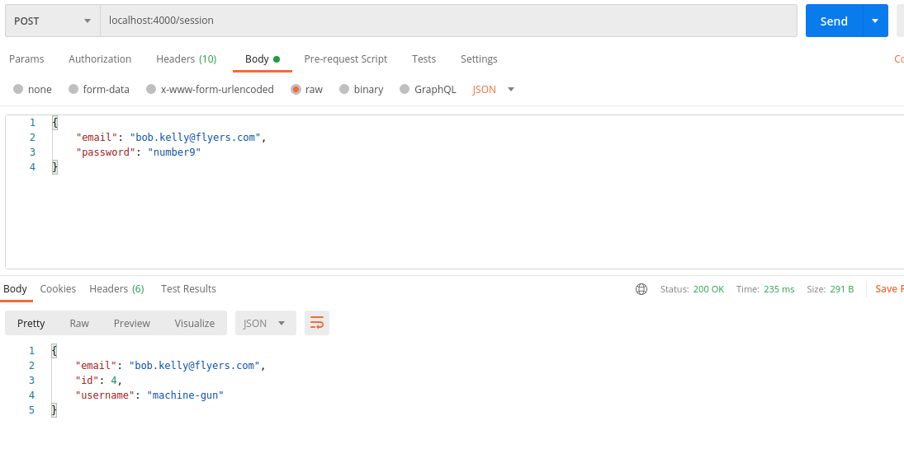
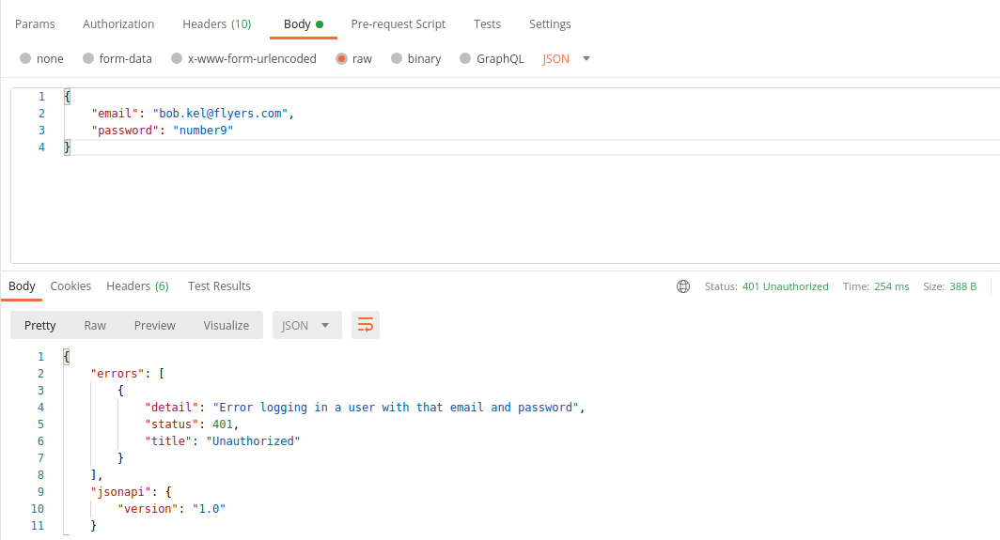
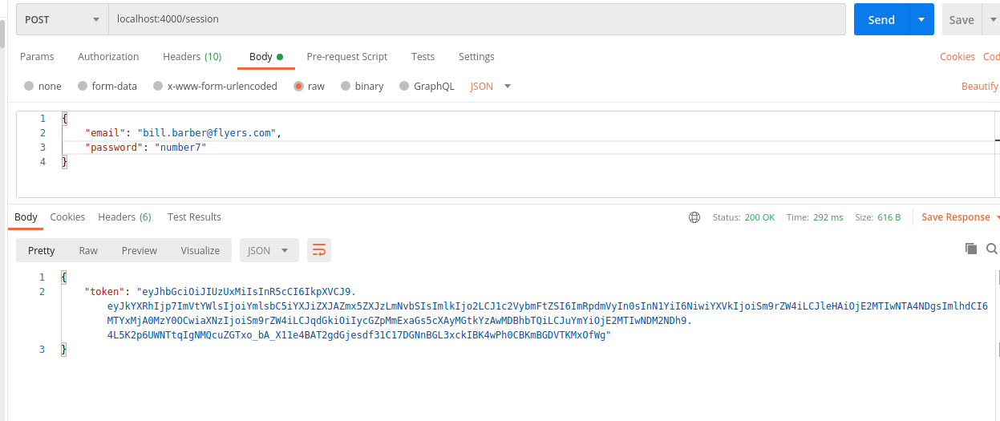
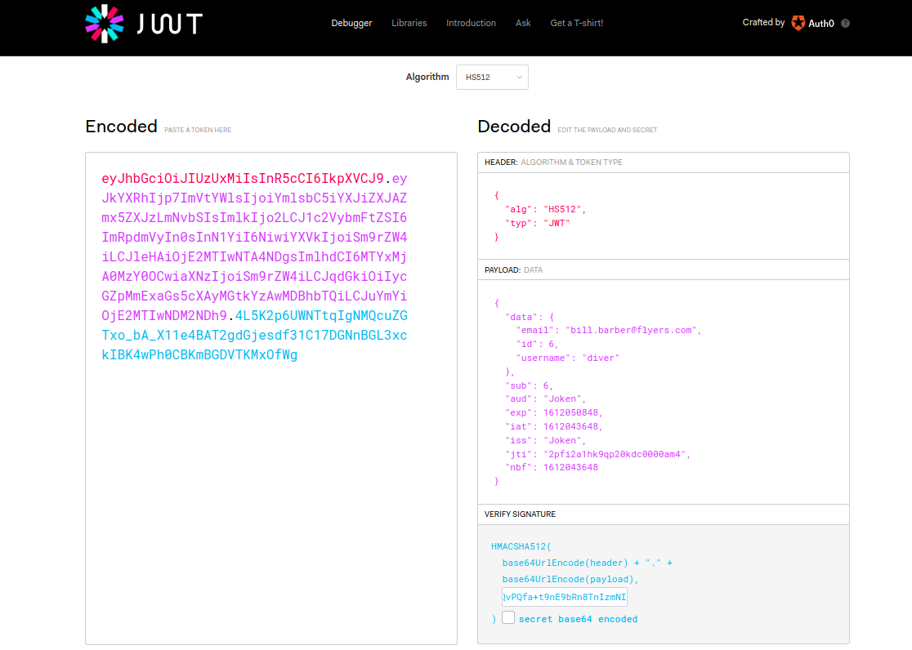
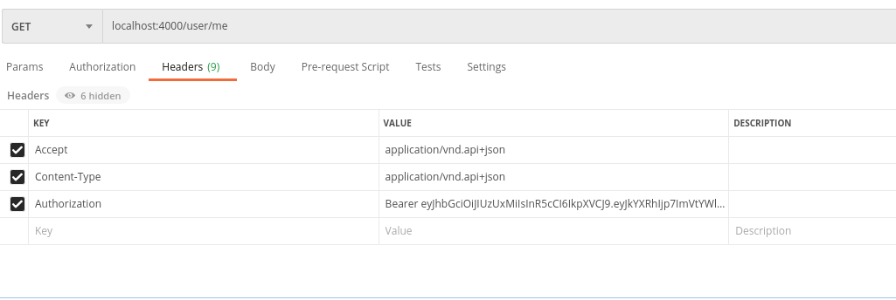
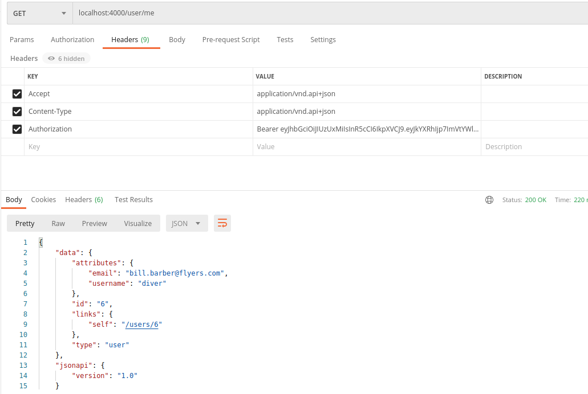
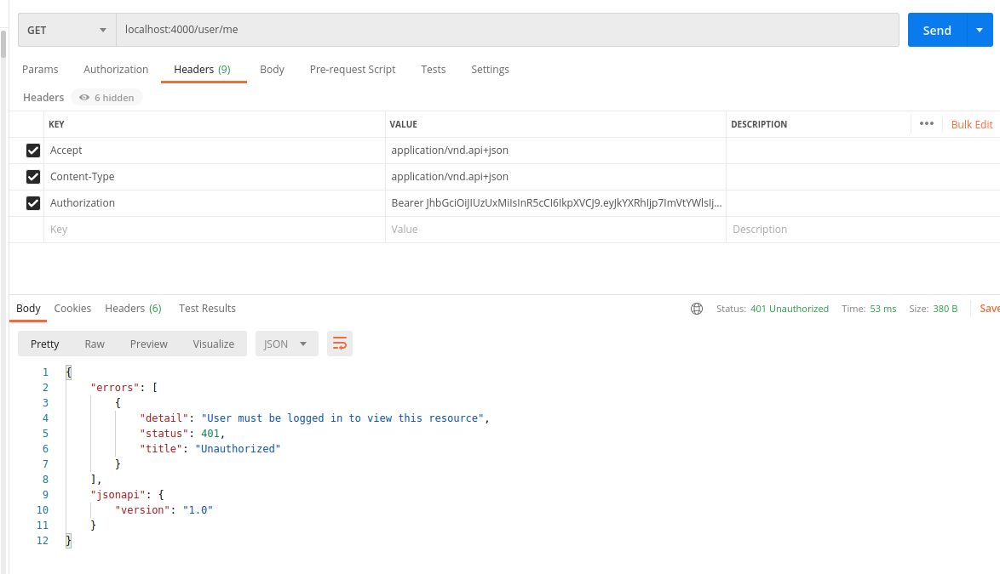

## User Registration, Authentication, and Authorization with Ember Octane and Phoenix

## Part 3: Add Login and Session Creation in Phoenix

June 14, 2020.
_____
**Fair warning**:  *I am a hack. I am an civil engineer that has a hobby doing web development. Follow me at your own risk!* That said, others may find it worthwhile to read my experiences in developing a web app.

Big Thanks to [**Embercasts**]() excellent course on using [Ember with a Phoenix backend]().  I have watched it three times, and bits and pieces over and over again. I cannot stress enough how well presented and thourough Ryan Tablada and Erik Brin were in putting this course together. The course is a couple of years old; it uses Ember v3.0.X, --which still works in the current version. It is still well worth the purchase price. The last time I went thorough the videos was to update the Ember code to Octane -- which turned out to be an excellent exercise in self-learning to understand Octane syntax, patterns, and implementation.

That said, I have made some changes to packages used, obviously updated to the current versions of both Ember and Phoenix, and implemented a few thing is different ways -- but full credit to previous works.

For this application, I will be using [Elixir Phoenix](https://www.phoenixframework.org/) (v1.5.5) as the backend that will serve up [JSON:API](https://jsonapi.org/) complient json to be used by an frontend developed in [Ember.js](https://emberjs.com/) ---  specifically *[Ember Octane](https://blog.emberjs.com/2019/12/20/octane-is-here.html)* --- this app will use Ember(v3.23).

This write up assumes you have all the necessary precursors installed as I will not be going over any of that. Suffice to say that you have to have elixir, mix, phoenix etc installed, posgresql (and postgis -- *just because* -- ) as well as npm, yarn, ember-cli etc, etc. I will try to point out where I found that additional programs or dependencies need to be updated or installed, but realize YMMV.

A note about the application. It is called **pucks** --- like hockey pucks.  I am Canadian. I like hockey. If this series of blog posts evolves into an on-going thing, then most folks will be able to understand the basic concepts and structure of players, leagues, teams, seasons, etc.
_________

## Server Side Issuing a JWT Token for a Session

We now have a working registration feature. Once a user is registered, they need to be able to login and then use the applicaiton, or atleast access and use the parts of the application for which they have permission. A common approach for this is to use a *session*, where a user logs in, is provided a JWT Token that resides on the browser, and subsequent actions on the site are verified with that Token until they log off or their session expires.

We will be using the [Joken](https://hexdocs.pm/joken/introduction.html) library for the JWT token functionality.

I will not go into what exactly JWT Token are or their advantages and disadvantages other than the basic definition (this from *Wikipedia*):

> A JOSON Web Token (JWT) is an Internet standard for creating data with optional signature and/or optional encryption whose payload holds JSON that asserts some number of claims. The tokens are signed either using a private secret or a public/private key. The tokens are designed to be compact, URL-safe, and usable especially in a web-browser single-sign-on (SSO) context. JWT claims can typically be used to pass identity of authenticated users between an identity provider and a service provider, or any other type of claims as required by business processes.

### The Plumbing

Let's begin by setting up our Session skelton, include the route in Route, a controller, and the required functions:

First the route.  It will be a *Post* method that will refer to a *create* function in the *SessionController*.

```elixir
# ./lib/pucks_web/router.ex

...

  scope "/", DaliWeb do
    pipe_through :api

    resources "/users", UserController, only: [:create, :index, :delete]
    
    post "/session", SessionController, :create     

  end

```

And now we required the ```SessionController``` with the ```:create``` method. Easiest just to create a new file in the ```pucks_web/controller`` directory.

```elixir
#./pucks_web/controller/session_controller.ex
defmodule PucksWeb.SessionController do
  use PucksWeb, :controller

  alias Pucks.People
  alias Pucks.People.User

  
  def create(conn, %{"email" => email, "password" => password}) do
    user = People.get_user_by_email!(email)
 
   
  end

end
```

The ```create``` method take the connection, and the parameters passed in from the login form, namely email and password (although we could use username instead/as well), and then matches the email with the registered users.  We need to add that method ```get_user_by_email!``` to our context.

```elixir
#./pucks/people.ex
  ...
  
  def get_user_by_email!(email) do
    Repo.get_by!(User, email: email)  
  end
...
  
end
```
We are using Ecto's ```get_by!``` method, passing in the model and the search field.

Back to the controller.

We eventually want to verify the user and then send them back a JWT token. We are not quite there yet.  For now we will send them back information on the user requested -- in other words, the user that corresponds to the email provided. 

We will add a render method that will pass the user struct to a view.

```elixir
#./pucks_web/controller/session_controller.ex

  ...
  
  def create(conn, %{"email" => email, "password" => password}) do
    user = People.get_user_by_email!(email)

    conn
    |>render("token.json", %{user: user})
   
  end

end
```

And now we need to create the corresponding ```sesion_view.ex``` file with a render method.

```elixir
#./pucks_web/controller/session_view.ex
defmodule PucksWeb.SessionView do
  use PucksWeb, :view
  #use JaSerializer.PhoenixView

  def render("token.json", %{user: user}) do
    %{id: user.id, email: user.email, username: user.username}
  
  end
end
```
So, a few  minor details:  we are not providing a json-api complient response. That's not necessary since we will ultimately be providing a authorization token to the client. We will also provide details on the user, however that will occur from the ```user_view```.

Okay.  If it is wired up properly, when we POST a request with an email and password of a user , we will get back the email, id, and username of the user. Try it in Postman.




Now try entering and invalid email. Our server replies with a 404 "Not found" error.  This represents a vulnerability since hackers could see which are valid emails. A better approach is returning a 401 error -- 'user not authorized'.  This could be because the user do not exist, or there was a mistake in the email or password.

To accomplish this -- we will go to the controller and insert a try-catch block.  The *happy_path* gets you... ultimately... to a JWT token and authorization.  The *not_happy_path* fails, regardless of how you got there.
```elixir
#./pucks_web/controller/session_controller.ex
  ...

  def create(conn, %{"email" => email, "password" => password}) do
    try do
      user = People.get_user_by_email!(email)
      
      conn
      |>render("token.json", %{user: user})
      
    rescue
      _error ->
        conn
        |> put_status(:unauthorized)
        |> put_view(PucksWeb.ErrorView)
        |> render("401.json-api", %{detail: "Error logging in a user with that email and password"})  
  end

  ...
```
So, unpacking the code, we added the try-catch. If there is an error in the authorization (or in this case just finding the user by the email entered) we will return the user and 401 status, with the message in the :detail.  We need to add the 401.json-api to our ```error_view``.
```elixir
#./pucks_web/controller/error_view.ex

...

  def render("401.json-api", %{detail: detail}) do
    %{status: 401, title: "Unauthorized", detail: detail}
    |>JaSerializer.ErrorSerializer.format()

  end

...
```
Pretty standard pattern we have seen before. We pipe the information into ```JaSerializer.ErrorSerializer.format``` method. 

Okay -- try it out with Postman --- both with a proper email, and then an invalid email:



There it is -- a 401 error with the detail message we provided.  Now, let's actually check the password supplied by the user matches with the one in the database. If so -- we want to generate a JWT Token and send it to the client.

Where we are now just checking for the email, we want a use Bcrypt to verify that the password is correct.

```elixir
#./pucks_web/controller/session_controller.ex
  ...

  def create(conn, %{"email" => email, "password" => password}) do
    try do
      user = People.get_user_by_email!(email)

      if Bcrypt.verify_pass(password, user.password_hash) do
        conn
        |> render("token.json", %{user: user})
      else
        conn
        |>put_status(:unauthorized)
        |> put_view(Pucks.ErrorView)
        |> render("401.json-api", %{detail: "Error loggin in with email and password"})   
      end

    rescue
      _err ->
        Bcrypt.no_user_verify()
        conn
        |>put_status(:unauthorized)
        |>put_view(PucksWeb.ErrorView)
        |>render("401.json-api", %{detail: "Error loggin in with email and password"})        
    end
  end
  ...
```
Walking through the create function, the email is checked, if valid, then the password supplied in the params is run in the *verify_pass* function. If the password check fails, we go to the else block and sent the *401* code and error message. If the email fails, then the error is the code moves to the **rescue** block. 

Here, we added a call to the *dummy* method *no_user_verify* provided with Bcrypt. Without including the dummy call, neferious peoples maybe able to lauch timing attacks against the site -- since a successful email would take longer to resolve than incorrect ones. The *no_user_verify* method makes the response time for the *sad_path* request similar to that of the *happy_path*.


The *session_view* is where we use Joken to actually issue the JWT. First, some housekeeping. As per the [Joken](https://hexdocs.pm/joken/introduction.html) docs, we will create a ```token.ex``` module under the ```lib``` directory. No methods are included since we will opt for defaults provided.
```elixir
#./lib/token.ex

defmodule Token do
  use Joken.Config

end
```
Back to the *session* -- the ```session_controller``` calls the ```render``` method for ```"token.json"``` in its ```view```, and passes in the *user* struct. Here is the ```session_view```:

```elixir
##./pucks_web/controller/session_view.ex
defmodule PucksWeb.SessionView do
  use PucksWeb, :view
  #use JaSerializer.PhoenixView

  def render("token.json", %{user: user}) do

    user_info = %{id: user.id, email: user.email, username: user.username}

    jwt = %{data: user_info, sub: user.id}
    signer = Joken.Signer.create("HS512", "super-secret-sauce"))
    token = Token.generate_and_sign!(jwt, signer)

    %{token: token}
  end

end
```
Looking at the ```render``` function, we assign the field of the user structure to the user_info variable.  We create a new struct (jwt) with the newly create structure assigned as data, and the *subject* for the claim -- ```user.id```.

Next, we have Joken sign the token -- a *signer* is a combination of an algorithm and a *key*. The [Joken docs](https://hexdocs.pm/joken/signer.html#content) explain this nicely. We are using an HS algorithm -- in our case ```HS512```, which requires a simple binary key. To start, we are passing in the hard-coded string "super-secret-sauce". Ideally, we want to have key as and environment variable, and something not contained in the actual code base.

Let's alter the signer line in our ```session_view```. Here, we make a system call to get the envrionment variable for our app with the key ```:jwt_secret```.

```elixir
##./pucks_web/controller/session_view.ex
defmodule PucksWeb.SessionView do
  use PucksWeb, :view
  #use JaSerializer.PhoenixView

  def render("token.json", %{user: user}) do

    user_info = %{id: user.id, email: user.email, username: user.username}

    jwt = %{data: user_info, sub: user.id}
    signer = Joken.Signer.create("HS512", (Application.get_env(:pucks, :jwt_secret)))
    token = Token.generate_and_sign!(jwt, signer)

    %{token: token}
  end

end
```
To wire this up, we will go to our config file:

```elixir
#./config/config.exs

...

config :pucks,
  ecto_repos: [Pucks.Repo],
  jwt_secret: System.get_env("JWT_SECRET") || "Av37mx6YjVtL9ZVnlu628ynHdSieRVzMW65wFDZMcQvPQfa+t9nE9bRn8TnIzmNI"

...

```

We add the system call for the environment variable "JWT_SECRET".  If there is no such variable, it uses the 64-character string provided (which was generated and copied using the handy ```mix phx.gen.secret``` command line generator). This is a bit harder to crack than our original key.

Okay, with a that completed, let's switch to Postman and provide a valid email and password as shown below:




And voila .... a JWT is generated and passed to the client!.

If you want to inspect the token ... copy it and paste the token in into the handy [JWT.io](https://jwt.io/) website and we can see the payload includes the user information provided in the user struct in the ```session_view```:




Okay, so now our Phoenix API can now verify a registered user and provide them with a token -- which will create a session on the client. We now need our backend to verify that the token is valid since it will be sent to the our API with every request from the client -- in the header.

## Authorizing a User and Returning a JWT Token

Going to make a request to the url /users/me

Postman --- set up a ```GET``` request to /users/me 

We add a ```Authorization``` header.  Content of the header will be the token.  The JWT we are providing, and how it will be used in our applicaiton, is referred to as a *Bearer* token.  From the [OAuth2 RFC](https://tools.ietf.org/html/rfc6750):

>A security token with the property that any party in possession of the token (a "bearer") can use the token in any way that any other party in possession of it can.  Using a bearer token does not require a bearer to prove possession of cryptographic key material (proof-of-possession).

So, in our header, the token will be prefaced with ```Bearer```.  Typing Bearer into the Authorization header, we paste in the token we received for a valid user (made with a ```POST``` to ```/session```, passing in valid credentials). 



The request will error because we have not set up our server to handle the ```/user/me``` request.  Let get on that.

First, we add the get requrest to our router.  The action will be handled by the user_controller in the :show_current method.

```elixir
#./pucks_web/router.ex

...

  scope "/", PucksWeb do
    pipe_through :api
  
    resources "/users", UserController, only: [:create, :index, :delete]

    post "/session", SessionController, :create
    get "user/me", UserController, :show_current   
    
   end

...

```

Switching to the ```UserController``` we create the ```show_current``` method. It will receive the connection --- and we will ignore what ever other parameters are sent.  I have also included the psuedo code for what we want the method to do:

```elixir
#./pucks_web/controllers/user_controller.ex

...
  def show_current(conn, _params) do

    # 1. get the token from the request header
    # 2. use Joken library to verify that the token is valid
    # 3. if it is valid -- then we look at the claims and get the user_id 
    # 4. pass the user_id to our Repo to get the user information
    # 5.  pass back the user formation to the client
    # 6. handle the case where the token is invalid
 
  end

...

```
So, filling in our pseudo-code the method looks like this
```elixir
#./pucks_web/controllers/user_controller.ex

  def show_current(conn, _params) do
    ["Bearer " <> token] = get_req_header(conn, "authorization")

    signer = Joken.Signer.create("HS512", (Application.get_env(:pucks, :jwt_secret)))
    claims = Token.verify_and_validate!(token, signer)

    %{"sub" => user_id} = claims

    user = People.get_user!(user_id)

    conn
    |> render("show.json-api", data: user)

  end
```
We use the Phoenix controller method ```get_req_header``` and pass in the heder key we want ("authorization"). The header is returned as an array of string (although in this case is is a one element array, with the string being "Bearer XXXXX"). To extract the token, we perform pattern-matching -- matching the string ```"Bearer "``` (note the trailing ```space```), concatenated with the ```token```, and assigning token to the that variable (Elixir smile!!)

Next, we un-encode the token using similar steps that we used to encode it.  We define the signer exactly like we did in our ```SessionController```, with the algorithm and secret key. 

We use Joken's ```verify_and_validate!``` method (note it is referenced from our ```Token``` module). This will return the token's claims, which we assign to that variable.

We then pattern-match, looking for the subject (```"sub"```) of the claim (which we know is the ```user_id```), and pass the user_id to our function that will get the user information corresponding to that user_id.

Finally, we return the user information to the client via the render function.

Let's try it out in Postman.  Sending the same get request as before, we get back the JSON-API formatted user information corresponding to that token.



## Invalid Token

How do we handle and invalid token?  Let's wrap the guts of the show_current function in a try-rescue block:

```elixir
#./pucks_web/controllers/user_controller.ex

  def show_current(conn, _params) do
    ["Bearer " <> token] = get_req_header(conn, "authorization")

    try do
      signer = Joken.Signer.create("HS512", (Application.get_env(:pucks, :jwt_secret)))
      claims = Token.verify_and_validate!(token, signer)

      %{"sub" => user_id} = claims

      user = People.get_user!(user_id)

      conn
      |> render("show.json-api", data: user)
    rescue
      _err ->
        conn
        |> put_status(:unauthorized)
        |> put_view(PucksWeb.ErrorView)
        |> render("401.json-api", %{detail: "User must be logged in to view this resource"})
    end
  end
```

An invalid token will return and unauthorized (401) status wihthe detail provided.

Try this out in Postman by altering our previous request Authorizaton header (for example delete the first character of the token):



Alright. We have it working. We can, however refactor our code so we use our token authorization in other controllers in our API. To do that, we want to move the heart of our ```show_current``` function, and turn it into a *Plug* function that can be added to any controller. What is a [*Plug*](https://hexdocs.pm/plug/readme.html) function? 

It is a function that takes a connection (and optional _options), performs a set of instructions, and returns the connection. 

Common functionality for ```*_web``` are located in ```./lib/pucks_web.ex``` module.

We will create a function in that module call, appropriately, ```authenticate_user``` 

```elixir
#./pucks_web.ex
  ...

  def controller do
    quote do
      use Phoenix.Controller, namespace: PucksWeb

      import Plug.Conn
      import PucksWeb.Gettext
      alias PucksWeb.Router.Helpers, as: Routes

      #added code for :authenticate_user plug
      alias Pucks.People

      def authenticate_user(conn, _params) do
        try do
          ["Bearer " <> token] = get_req_header(conn, "authorization")

          signer = Joken.Signer.create("HS512", (Application.get_env(:pucks, :jwt_secret)))
          claims = Token.verify_and_validate!(token, signer)

          %{"sub" => user_id} = claims

          user = People.get_user!(user_id)

          params = Map.get(conn, :params) # assigning the :params from the connection to local map variable
          |>Map.put(:current_user, user)  # adding a :current_user key to the local params map and assigning its value to the user that was returned from the token

          conn
          |> Map.put(:params, params)   # assigning the :params map to the altered params map (re-map the :params).

        rescue
          _err ->
            conn
            |> put_status(:unauthorized)
            |> put_view(PucksWeb.ErrorView)
            |> render("401.json-api", %{detail: "User must be logged in to view this resource"})
            |> halt
        end
      end
     #end of added code 
    end

  end
  ...

```

Unpacking the code, we first alias our ```People``` module (which we use to query the repo). The ```authenticate_user``` function takes the connection, and we ignore any other parameters that are passed in (since we are interested the information in the header).

Then, we basically past in the same code that was in our ```UserController```.

There are some changes that have to be made. In the controller, the happy_path rendered the user information directly.  We may not want to do that most of the time. Rather we want to return that information to identify the ```current_user``` in the session. To accomplish this, after we get the user informaiton from the Repo, we do the following (explained in the comments on the same line.)

Finally, we have to modify our UserController, providing it the ```:authenticate_user``` plug, and removing all the code that is now in the plug.

```elixir
#./pucks_web/user_controller.ex

  ...
  action_fallback PucksWeb.FallbackController

  plug :authenticate_user when action in [:show_current]

  def show_current(conn, %{current_user: user}) do

    conn
    |> render("show.json-api", data: user)

  end
  ...
```

That's a lot less code!  Add the plug, however we restrict is use to the ```:show_current``` method.

In the ```show_current``` method, we get the ```current_user``` from the strut returned from the plug, and we render the user information to the client. 

Run through the Postman requests we did before --- paste in the token, the user information should be returned; send a corrupted token and we should see the error message.  

So our API can now register a user, provide a registered user with a JWT when the login with valid credentials, and finally it will authenticate a JWT that is supplied in the header of a request, and assigning the authenticated user as the ```current_user```.

Next step ..... adding login funtionality to the client, and having the client create a session for the current_user.


