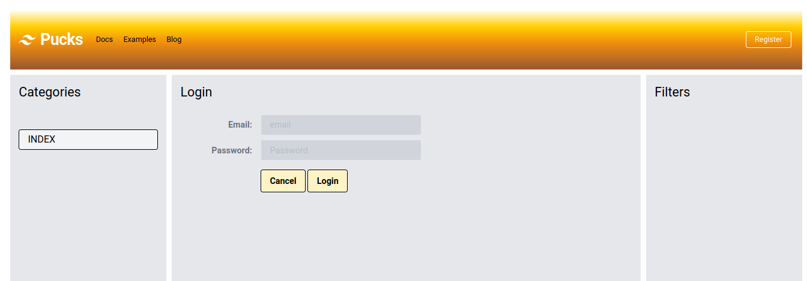
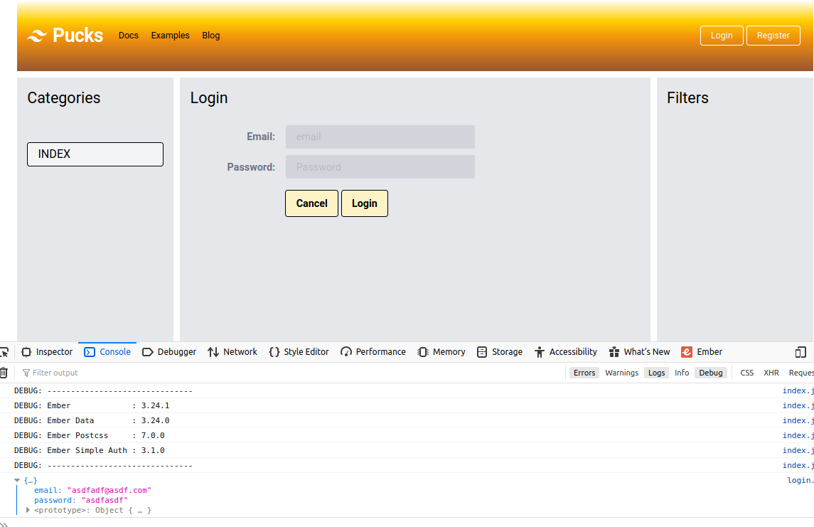
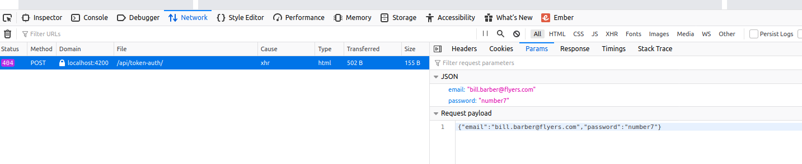
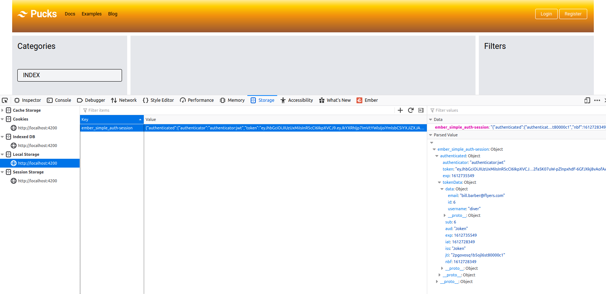

## Part 4: Add Login and Session Creation in Ember with Simple Auth

February 6, 2021.
_____
**Fair warning**:  *I am a hack. I am an civil engineer that has a hobby doing web development. Follow me at your own risk!* That said, others may find it worthwhile to read my experiences in developing a web app.

Big Thanks to [**Embercasts**]() excellent course on using [Ember with a Phoenix backend]().  I have watched it three times, and bits and pieces over and over again. I cannot stress enough how well presented and thourough Ryan Tablada and Erik Brin were in putting this course together. The course is a couple of years old; it uses Ember v3.0.X, --which still works in the current version. It is still well worth the purchase price. The last time I went thorough the videos was to update the Ember code to Octane -- which turned out to be an excellent exercise in self-learning to understand Octane syntax, patterns, and implementation.

That said, I have made some changes to packages used, obviously updated to the current versions of both Ember and Phoenix, and implemented a few thing is different ways -- but full credit to previous works.

For this application, I will be using [Elixir Phoenix](https://www.phoenixframework.org/) (v1.5.5) as the backend that will serve up [JSON:API](https://jsonapi.org/) complient json to be used by an frontend developed in [Ember.js](https://emberjs.com/) ---  specifically *[Ember Octane](https://blog.emberjs.com/2019/12/20/octane-is-here.html)* --- this app will use Ember(v3.23).

This write up assumes you have all the necessary precursors installed as I will not be going over any of that. Suffice to say that you have to have elixir, mix, phoenix etc installed, posgresql (and postgis -- *just because* -- ) as well as npm, yarn, ember-cli etc, etc. I will try to point out where I found that additional programs or dependencies need to be updated or installed, but realize YMMV.

A note about the application. It is called **pucks** --- like hockey pucks.  I am Canadian. I like hockey. If this series of blog posts evolves into an on-going thing, then most folks will be able to understand the basic concepts and structure of players, leagues, teams, seasons, etc.
_________


Pre-amble about [ember-simple-auth](https://github.com/simplabs/ember-simple-auth)

install the addons ember-simple-auth and ember-simple-auth-token since we are use JWT to authenticate.

generate a ```login``` route and controller; generate a ```login-form``` component

Our user with login with an email and a password, which we will not persist, so in the ```login route```, let's put a pojo wiht those fields and return them from the ```model``` hook.
```javascript
// ./app/routes/login.js
import Route from '@ember/routing/route';

export default class LoginRoute extends Route {

  model(){
    return {
      email: '',
      password: ''
    }
  }

}
```
in the ```login``` template, add our ```login-form``` component, and pass in the ```@user``` parameter set to the backing ```@model```
```handlebars
 <!-- ./app/template/login.hbs -->

<LoginForm @user={{@model}}   />

```

Okay, let's setup a basic login form, with a fields for email and password (you can copy the registration form and change it to suit).

```handlebars
 <!-- ./app/components/login-form.hbs -->

<div class="text-2xl mb-2">
  Login
</div>
<hr>


<form class="w-full max-w-md mt-4" {{on "submit" this.submitCreds}} >

  <div class="md:flex md:items-center mb-2">
    <div class="md:w-1/3">
      <label class="block text-gray-500 font-bold md:text-right mb-1 md:mb-0 pr-4" >
        Email:
      </label>
    </div>
    <div class="md:w-2/3">
      <Input class="std-input"  type="text" @value={{this.email}} placeholder="email" />
    </div>
  </div>

  <div class="md:flex md:items-center mb-2">
    <div class="md:w-1/3">
      <label class="block text-gray-500 font-bold md:text-right mb-1 md:mb-0 pr-4" >
        Password:
      </label>
    </div>
    <div class="md:w-2/3">
      <Input class="std-input"  type="password" @value={{this.password}} placeholder="Password" />
    </div>
  </div>

  <div class="md:flex md:items-center mt-4">
    <div class="md:w-1/3"></div>
    <div class="md:w-2/3">
      <button class="add-btn" type="button">Cancel</button>

      <button class="add-btn" type="submit" >Login</button>
    </div>
  </div>

</form>
```
Basic stuff ... a login form with and email and password field. When we submit the form, we are calling the submitCreds function, which goes in the components backing class.  lets wire that up or the browser will complain.
```javascript
// ./app/routes/login.js
import Component from '@glimmer/component';
import { action } from '@ember/object';

export default class LoginFormComponent extends Component {

@action
submitCreds(ev) {
  ev.preventDefault();

}

}
```
So now if we go to the browser and type in the url  ```localhost:4200/login``` we should see the following:



The form shows up, but it is not doing anything. Let's change that (we will be following a similar pattern to our ```registration-form``` component):
```javascript
// ./app/routes/login.js
import Component from '@glimmer/component';
import { action } from '@ember/object';
import { tracked } from '@glimmer/tracking';

export default class LoginFormComponent extends Component {

@tracked email
@tracked password

@action
submitCreds(ev) {
  ev.preventDefault();

  this.args.loginUser({
    email: this.email,
    password: this.password  
  })

  this.email = ''
  this.password = ''
}

}
```
The submitCreds action takes gets the values from the form and assigns them to the arguments for the ```loginUser``` function which we know was passed in when the component was invoked (we still have to add that!) and the function itself will be in the backing controller, the ```LoginController``` in this case. We then reset the form fields to empty strings.
Let's add the function to the arguments in the invocation.
```handlebars
 <!-- ./app/template/login.hbs -->

<LoginForm 
  @user={{@model}}   
  @loginUser={{this.authenticateUser}}
/>
```
Then in the backing controller, we add the authenticateUser action. I choose to name the function differently to emphasis that ```@loginUser``` is the arg that is passed into the component, and ```this.authenticateUser``` is in the controller. Speaking of controllers:
```javascript
// ./app/controllers/login.js

import Controller from '@ember/controller';
import { action } from '@ember/object';

export default class LoginController extends Controller {

@action
authenticateUser(attrs) {
  console.log(attrs);

}

}
```
So we have roughed in the ```authenticateUser``` function, for now logging the attrs that are passed in.

We can try out the form in the browser. First, let's add a login button next the the Register button so we can get to the route without having to type in the url:
```handlebars
<!-- ./app/components/top-nav.hbs -->
    ...
      <div>
        <LinkTo @route="login" @model={{@model}} class="logging-btn" >Login</LinkTo>
      </div>
      <div>
        <LinkTo @route ="registration" class="mx-1 logging-btn" >Register</LinkTo>
      </div>
    ...
```
We just copied the ```Register``` button, changing the ```@route``` and name. Click the login button and you get the following:



I actually entered some garbage in the email and password field, and we can see it displayed in the console --- and the form was cleared.  It appears to be working.

## Login a User 


We have a roughed in Login form component with a placeholder action in the controller.  Let's put ```ember-simple-auth```, and ```ember-simple-auth-token``` to use. I will basically be following the examples in the [docs](https://github.com/simplabs/ember-simple-auth#the-session-service)

First, we want to inject the session service provided by ```ember-simple-auth```. We also require glimmer's tracked functionality for the ``errorMessages`` that will be returned from our server in the event of a invalid credentials. Here is the revised ```LoginController```:


```javascript
// ./app/controllers/login.js

import Controller from '@ember/controller';
import { action } from '@ember/object';
import { inject as service } from '@ember/service';
import { tracked } from "@glimmer/tracking";

export default class LoginController extends Controller {

@tracked errorMessage
@service session  //session service provided by ember-simple-auth

@action
async authenticateUser(attrs) {
  try {
  await this.session.authenticate('authenticator:jwt', {
    email: attrs.email,
    password: attrs.password
    });
    this.transitionToRoute('index');
  } 
  catch(error) {
    this.errorMessage = error.error || error; 
  }
}

}
```
Focussing on the authenticateUser function, we use ESA's [authenticate](http://ember-simple-auth.com/api/classes/SessionService.html#method_authenticate) method, which is part of the session service. It takes two arguments: the authenticator --- which in our case is ```:jwt``` (from ESA-token); and the *email* and *password* values that were entered in the form. If the login was successful --- we redirect the logged in user to the ```index``` page.

If it was unsuccessful, we catch the error and assign it to the errorMessage variable. This must be passed on to the login-form component, but we will address that after we see if our happy_path is working.  Enter in valid credentials for a registered user -- you should see the login for clear, but no redirection occurs. There are no console errors ... so let's go to the network tab and see what happended to our request:



The ```POST``` request is being submitted to ```/api/token-auth```. This is the default set by ```ember-simple-auth-token```. We do see that the JSON payload of a valid user and password was sent with the request. Let's review the ESA-token [Customization docs](https://github.com/jpadilla/ember-simple-auth-token#customization-options) and configure the endpoint to hit our the right API (http://localhost:4000/session). Configuring addons is usually handled in the ```config/environment.js```  file.

```javascript
// ./config/environment.js

    .....
    EmberENV: {
      FEATURES: {
        // Here you can enable experimental features on an ember canary build
        // e.g. EMBER_NATIVE_DECORATOR_SUPPORT: true
      },
      EXTEND_PROTOTYPES: {
        // Prevent Ember Data from overriding Date.parse.
        Date: false,
      },
    },
    
    'ember-simple-auth-token': {
      identificationField: 'email',
      passwordField: 'password',
      serverTokenEndpoint: 'http://localhost:4000/session',
      headers: {
        'Content-Type': 'application/vnd.api+json',
        'Accept': 'application/vnd.api+json'
      },
      refreshAccessTokens: false
    },
    .....
```
Following the docs, we add the ```identificationField```, ```passwordField```, ```serverTokenEndpoint```, as well as our json-api headers. We also set ```refreshAccessTokens``` to false since we are not refreshing tokens. Re-start the ember server (and make sure our Phoenix API server is running) and let's see if we actually can login. Entering in valid credentials, we are re-directed to the ```index``` page. No console errors. If we check our request, we see it was sent to our Phoenix API server url. Let's see what we have in the ```Storage``` tab of the ```Inspector```. 



By default, ESA uses ```localStorage``` by default to store the our token. Read the [docs](https://github.com/simplabs/ember-simple-auth#session-stores) if you want to use the other three options (```Cookies```, ```indexDB```, or ```SessionStorage```). Note that if you are using, or planning to use [Ember FastBoot](https://ember-fastboot.com/), you have to use the ```Cookies``` storage option.

We see we have an ember_simple_auth-session, within that object we have a token, and all of the assoicated information Joken provided --notably a "sub" (subject) of ```6```, which corresponds to the ```user_id```. Recalling in our API, we retrieved the user information that corresponded to that ```user_id```, and sent it along in JSON-API format. That informaiton is housed in the ```:data``` key of the ```tokenData``` object (expanded in the screenshot above).

Looks good. Let's further use ESA ```session``` service to add some information that a user is logged in.  When a user is logged in, we no longer require a ```Register``` or ```Login``` button --- a ```Logout``` button would suffice.

The session service provides an ```isAuthenticated``` method that we will utilize. Since our Login and Register buttons are part of the <TopNav/> component, we need to inject the session service into the component's backing class. Like so:
```javascript
// ./app/components/top-nav.js
import Component from '@glimmer/component';
import { action } from '@ember/object';
import { inject as service } from '@ember/service';

export default class TopNavComponent extends Component {

@service session;

@action
logout(ev) {
  ev.preventDefault();

  this.session.invalidate();
}

}

```
We also included the action that is to be fired when the Logout button is clicked -- which is the ```invalidate``` method provided with ESA.

With that in place, we can add the conditional logic to our template:
```handlebars
<!-- ./app/components/top-nav.hbs -->
    .....
    {{#if this.session.isAuthenticated}}
      <div>
        <button type="button" class="logging-btn" {{on "click" this.logout}}>Logout</button>
      </div>
    {{else}}
      <div>
        <LinkTo @route="login" class="logging-btn" >Login</LinkTo>
      </div>
      <div>
        <LinkTo @route ="registration" class="mx-1 logging-btn" >Register</LinkTo>
      </div>
    {{/if}}
    .....
```
Pretty straight forward, if the user ```isAuthenticated```, we show the Logout button, that will fire the ```logout()``` action we created in the backing class. If a user is not authenticated, we show the ```Login``` and ```Register``` button. Reload the page, open the Inspector>Storage tab and Login, then Logout. Notice the ```ember_simple_auth-session``` object is emptied upon logout. Nice.

## Managing the Current User for a Session

We want to create a current-user service that we can inject into various parts of our application. Again, the [ember-simple-auth docs](https://github.com/simplabs/ember-simple-auth/blob/master/guides/managing-current-user.md#managing-a-current-user) explain this quite well and we will follow those docs, with a few changes.

We will create a service for the ```current-user``` that will get the current-user information. Let's use the generator for that.

```zsh
ember g service current-user
```
That creats a ```app/services``` directory and a current-user.js file. 
```javascript
import Service, { inject as service } from '@ember/service';

export default class CurrentUserService extends Service {

  @service session;
  @service store;
  
  async load() {
    if (this.session.isAuthenticated) {
      let user = await this.store.queryRecord('user', { me: true });
      this.set('user', user);
    }
  }

}
```

In the service, the ```session``` (from ESA) and the ```store``` (from ember-data) are injected. The service has one funciton load().
If the user ```isAuthenticated```, we query the store for the ```user``` record where the user_id is not known. Hence the  ```{ me: true }```. It is explained well in the docs. However, also recall in our API we have the authentication request goint to the ```/user/me``` endpoint. Now it is starting to make sense!

We have wire up a few more elements for this to work,  Namely, let's generate a UserAdapter, which will extend our ApplicationAdapter.
```zsh
ember g adapter user
```

Then, as per the docs: 

>We can override the adapter to generate /users/me when store.queryRecord is invoked with a query param where the me param is present.

```javascript
// ./app/adapters/user.js
import ApplicationAdapter from './application';

export default class UserAdapter extends ApplicationAdapter {

  // api requires that login creds be routed to /user/me 

  urlForQueryRecord(query) {

    let originalUrl = super.urlForQueryRecord(...arguments);

    if (query.me) {
      delete query.me;
      return `${originalUrl}/me`;
    }
      return originalUrl;
  }  
}
```
To use the ```@service currentUser```, we will inject it into the ```ApplicationRoute```. Let's generate that route (do not override the application template!!):

```zsh
ember g route application
```

And we will add the following (again, following the docs):

```javascript
// ./app/routes/application.js
import Route from '@ember/routing/route';
import { inject as service } from '@ember/service';

export default class ApplicationRoute extends Route {

  @service session;
  @service currentUser;

  beforeModel() {
    return this._loadCurrentUser();
  }

  async _loadCurrentUser() {
    try {
      await this.currentUser.load();
    } catch(err) {
      await this.session.invalidate();
    }
  }
}
```
We have to override ESA's handleAuthentication method for this to work. Create a file under the ./app/services directory called session.js. Here is the required code:
```javascript
// ./apps/services/session.js

import { inject as service } from '@ember/service';
import BaseSessionService from 'ember-simple-auth/services/session';

export default class SessionService extends BaseSessionService {
  @service currentUser;

  async handleAuthentication() {
    this._super(...arguments);

    try {
      await this.currentUser.load();
    } catch(err) {
      await this.invalidate();
    }
  }
}
```

Finally, we need to access the authorization data (i.e. the token).  To do that, we add a getter to our ApplicationAdapter.

```javascript
// ./app/routes/application.js

import JSONAPIAdapter from '@ember-data/adapter/json-api';
import { inject as service } from '@ember/service';
import { tracked } from '@glimmer/tracking';

export default class ApplicationAdapter extends JSONAPIAdapter {

  host = 'http://localhost:4000';

  @service session;
  
  @tracked 'session.data.authenticated.token';

  // found header example in ember adapter docs to avoid @computed in favour of @tracked and get
  get headers() {
    if (this.session.isAuthenticated) {
      return {
        'Authorization': `Bearer ${this.session.data.authenticated.token}`
      }
    }
    return {}
  }
  //as per the ESA docs

  // @computed('session.data.authenticated.token')
  // get headers() {
  //   let headers = {};
  //   if (this.session.isAuthenticated) {
  //     headers['Authorization'] = `Bearer ${this.session.data.authenticated.token}`;
  //   }
  //   return headers;
  // }
}
```
I altered the code in the docs to use ```@tracked``` and a pure ```getter```, as opposed to ```@computed``` (included the commented out code from the docs anyway). I found an example of using a getter instead of a computed property (which apparently is preferred in *Octane*) in the [Ember Adapter docs](https://guides.emberjs.com/release/models/customizing-adapters/#toc_headers-customization).

Since we went to all that work, let's display our currentUser's username in the ```<TopNav />``` component beside the Logout button. We have to inject the ```currentUser``` service into the backing component. 
```javascript
// ./app/components/top-nav.js
import Component from '@glimmer/component';
import { action } from '@ember/object';
import { inject as service } from '@ember/service';

export default class TopNavComponent extends Component {

  @service session;
  @service currentUser;

  @action
  logout(ev) {
    ev.preventDefault();

    this.session.invalidate();
  }

}

```
And then in the template, we modify the button section:
```handlebars
<!-- ./app/components/top-nav.hbs -->
    .....
   {{#if this.session.isAuthenticated}}

      {{#if this.currentUser.user}}
        <div class="logging-btn">
          {{this.currentUser.user.username}} ||  id: {{this.currentUser.user.id}}
        </div>
      {{/if}}

      <div>
        <button type="button" class="mx-1 logging-btn" {{on "click" this.logout}}>Logout</button>
      </div>

    {{else}}

      <div>
        <LinkTo @route="login" class="logging-btn" >Login</LinkTo>
      </div>
      <div>
        <LinkTo @route = "registration" class="mx-1 logging-btn" >Register</LinkTo>
      </div>

    {{/if}}
  .....
```
If we have a valid current user, we display their username and id in a button. Obviously we would not display that in the applicaiton --- if the user had an avatar or something, that could be displayed in its place. 

That wraps it up. I hope you learned something ... I know I certainly did.  I am sure I have made mistakes, or adopted poor practices. I am always open for constructive critism and suggests. 

Next up, I want to tackle image uplaods.  I think I will be using the [Waffle](https://github.com/elixir-waffle/waffle#waffle) library on the server, and [ember-file-upload](https://adopted-ember-addons.github.io/ember-file-upload/docs/) on the client.  Stay tuned.

Thanks for reading.


